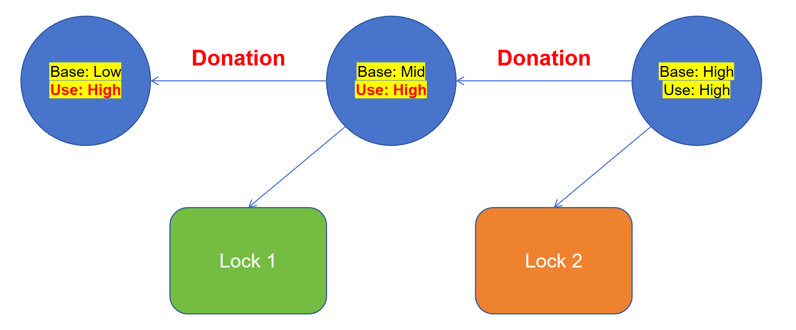

# CS130 Project 1: Design Document
## Group
> Fill in the names and email addresses of your group members.

- He Yunxiang <heyx1@shanghaitech.edu.cn>
- Fan Yicheng <fanych1@shanghaitech.edu.cn>

## Preliminaries
> If you have any preliminary comments on your submission, notes for the TAs, or extra credit, please give them here.

> Please cite any offline or online sources you consulted while preparing your submission, other than the Pintos documentation, course text, lecture notes, and course staff.

## Alarm Clock
### Data Structures
#### A1
> Copy here the declaration of each new or changed struct or struct member, global or static variable, `typedef', or enumeration.  Identify the purpose of each in 25 words or less.
```cpp
struct thread {
    ...
    /* Add for Project 1.1 */
	bool in_sleep;		 // Flag of thread is sleeping!
	int64_t sleep_until; // If the thread is sleeping, this variable mark the wake-up time
    ...
}
```

### Algorithms

#### A2
> Briefly describe what happens in a call to timer_sleep(), including the effects of the timer interrupt handler.

In timer_sleep, we:
1. Disable Interrupt for operating threads 
2. Setting the current thread's wating parameters
3. Block the current thread
4. Re-Enable the interrupts.

#### A3
> What steps are taken to minimize the amount of time spent in the timer interrupt handler?

In the `timer_interrupt`, we invoke `thread_foreach` to perform `wake_up_check` on each thread, which can wake up all the threads that need to be awakened in a stable $O(n)$ time.

### Synchronization

#### A4
> How are race conditions avoided when multiple threads call `timer_sleep()` simultaneously?

We disable interrupt immediately when we call `timer_sleep`, so the interrupt handler will not be called when we do timer_sleep operations. That makes no simutaneously operation.

#### A5
> How are race conditions avoided when a timer interrupt occurs during a call to timer_sleep()?

We disable interrupt immediately when we call `timer_sleep`, so timer interrupt handler will not be called during we execute `timer_sleep`.

### Rationable
#### A6 
> Why did you choose this design?  In what ways is it superior to another design you considered?

We have considered maintaining a priority queue to achieve $O(1)$ wake-up for threads, or separately maintaining a 'sleeping_thread' list. However, considering that the number of threads in the system usually does not exceed the magnitude of $10^2$, even with an $O(n)$ scanning algorithm, its performance is already sufficient, and its constant factor is small enough. Therefore, we have chosen the simplest and most intuitive implementation approach, which is to iterate through all threads in the timer_interrupt, minimizing our development time.

## Priority Scheduling
### Data Structures
#### B1
> Copy here the declaration of each new or changed struct or struct member, global or static variable, typedef, or enumeration.  Identify the purpose of each in 25 words or less.
```cpp
struct thread{
    ...
	/* Add for Project 1.2 */
	int priority_base; // The base priority before donation, it's the "True Priority"
	int priority_used;// The priority that the thread used in comparison, it's the "Effective Priority"
	struct list donaters; // The list of donaters
	struct thread* donatee; // The thread that the current thread donate to
	struct list_elem donatee_elem; // The list element of the donatee
    ...
}
```
Noticed that we use priority_after_donation to replace original priority.

#### B2
Explain the data structure used to track priority donation. Use ASCII art to diagram a nested donation.  (Alternately, submit a `.png` file.)
- The `priority_base` is the base priority of the thread, which is the priority of the thread before donation.
- The `priority_used` is the priority that the thread used in comparison, which is the priority of the thread after donation.
- The `donaters` is the list of donaters of the thread.
- The `donatee` is the thread that the current thread donate to.
- The `donatee_elem` is the list element of the donatee, used in donatee's donaters list.




### Algorithms

#### B3
How do you ensure that the highest priority thread waiting for a lock, semaphore, or condition variable wakes up first?
- For `samephore`:
  - Iterate through `sema->waiters` to get the thread with maximum priority
  - Unblock that thread.
  - Call `thread_yield()` because the current thread may be not that thread with maximum priority.
- For `lock`:
  - The lock is implemented with sema. So, we only need call `sema_up(&lock->semaphore)` to choose the thread with maximum priority.
- For Condition Variable:
  - When `conda.signal` call the `sema_up`, we use our `list_pop_max` to sema up the waiter with maximum priority.

#### B4
Describe the sequence of events when a call to lock_acquire() causes a priority donation.  How is nested donation handled?
1. Disable the interrupt.
2. If the lock are available(i.e. no lock holder), skip the donation check.
   - Otherwise, do priority donation by run `Donation_At_LockAcquire`.
3. The current thread is added to the list of donators (donaters) of the `lock->holder`. 
   - This indicates that the current thread is willing to donate its priority to the lock holder.
4. Do donation in a while-loop.
   - Set the `lock->holder` as the donatee
   - Donate the priority from the current thread to the donatee
   - If the donatee are still have a donatee and the donatee's priority is lower than the current thread, continue the donation. After the donation, the donatee will be the donatee's donatee.
5. Call `sema_down` to acquire the lock
6. set the current thread as `lock->holder`
7. Re-Enable the interrupt as old_status.

#### B5
Describe the sequence of events when lock_release() is called on a lock that a higher-priority thread is waiting for.
1. Disable the interrupt.
2. Get donaters as the lock's sema's waiters.
3. Run `ResetDonatee` for every donater in the donaters.
   - Remove the current thread from the donater's donaters list.
4. Run `check_after_release` for current thread.
   - Reset the `priority_used` to its `priority_base`.
   - Redo the donation that set the `priority_used` to the maximum priority of its donaters.
5. Call `sema_up` to release the lock.
6. Re-Enable the interrupt as old_status.
7. Call `thread_yield` to yield the CPU to the thread with maximum priority.

### Synchronization
#### B6
Describe a potential race in `thread_set_priority()` and explain how your implementation avoids it.  Can you use a lock to avoid this race?

In the function `thread_set_priority()`, there is a potential race condition due to the use of `donaters` to re-calculate priority. This list is only modified within the `lock_release()` and `lock_acquire()` functions. If proper synchronization measures are not taken, multiple threads may concurrently access and modify the donator_list, leading to a race condition where inconsistent or incorrect priority values may be set for the thread.

Noticed that in both `lock_acquire()` and `lock_release()`, we disable interrupt to avoid race conditions. So the `thread_set_priority()` have no potential race.


### Rationale

#### B7
Why did you choose this design?  In what ways is it superior to another design you considered?

1. To handle `thread_set_priority` correctly, we have to track the `donaters` of the thread. So we add list `donaters` and list element `donatee_elem` to the thread struct.
2. To handle chain donation, we add a donatee to the thread struct to track the donatee of the thread.
3. We still use list to track the donaters of the thread. So we implement `list_pop_max` to pop out the thread with maximum priority.

## Advanced Scheduler
### Data Structures
#### C1
Copy here the declaration of each new or changed struct or struct member, global or static variable, typedef, or enumeration.  Identify the purpose of each in 25 words or less.
```cpp
struct thread{
    ...
	/* Add for Project 1.3 */
	int nice; // The nice value of thread, -20 <= nice <= 20
	FixedPoint32 recent_cpu; // A Fixed Point Value record the recent CPU time.
    ...
}
```

#### Algorithms
#### C2
Suppose threads A, B, and C have nice values 0, 1, and 2.  Each has a recent_cpu value of 0.  Fill in the table below showing the scheduling decision and the priority and recent_cpu values for each thread after each given number of timer ticks:

|Timer Ticks | RecentCPU-A | RecentCPU-B |RecentCPU-C | Priority-A | Priority-B | Priority-C | Thread To Run |
|   -------  |  ---------  |  ---------  |  --------  |  --------  |  --------  |  --------  |  -----------  |
| 0  | 0  | 0 | 0 | 63 | 61 | 59 | A |
| 4  | 4  | 0 | 0 | 62 | 61 | 59 | A |
| 8  | 8  | 0 | 0 | 61 | 61 | 59 | A |
| 12 | 12 | 0 | 0 | 60 | 61 | 59 | B |
| 16 | 12 | 4 | 0 | 60 | 60 | 59 | B |
| 20 | 12 | 8 | 0 | 60 | 59 | 59 | A |
| 24 | 16 | 8 | 0 | 59 | 59 | 59 | A |
| 28 | 20 | 8 | 0 | 58 | 59 | 59 | B |
| 32 | 20 | 12 | 0 | 58 | 58 | 59 | C |
| 36 | 20 | 12 | 4 | 58 | 58 | 58 | C |

#### C3
Did any ambiguities in the scheduler specification make values in the table uncertain?  If so, what rule did you use to resolve them?  Does this match the behavior of your scheduler?

- Yes.
- The specification do not mention how to choose thread when there are multiple threads with maximum priority. 
  - We choose the current thread to run in this situation.
- This may not match the behavior of our scheduler, because our scheduler will choose the first thread with maximum priority in the ready list by our `list_pop_max`.

#### C4
How is the way you divided the cost of scheduling between code inside and outside interrupt context likely to affect performance?
- Inside interrupt context:
  - We update recent_cpu every tick.
  - We update priority and get the thread with maximum priority every 4 ticks.
  - This will cost $O(n)$ time.
  - If the number of threads in the system usually does not exceed the magnitude of $10^2$, the performance is already sufficient, and its constant factor is small enough.
- Outside interrupt context:
  - We do nothing.

### Rationale
#### C5
Briefly critique your design, pointing out advantages and disadvantages in your design choices.  If you were to have extra time to work on this part of the project, how might you choose to refine or improve your design?
- Advantages:
  - Our implementation approach is simple and straightforward, which significantly saves development time.
- Disadvantages:
  - Our implementation approach is simple and straightforward, which may lead to a decrease in performance.
- If we have extra time to work on this part of the project:
  - (For Project 1.1) we may choose to implement a priority queue to achieve $O(1)$ wake-up for threads, or separately maintain a 'sleeping_thread' list. This can improve the performance of the scheduler.
  - We may only update the priority of the thread when the priority of the thread is changed, which can improve the performance of the scheduler.

#### C6
The assignment explains arithmetic for fixed-point math in detail, but it leaves it open to you to implement it.  Why did you decide to implement it the way you did?  If you created an abstraction layer for fixed-point math, that is, an abstract data type and/or a set of functions or macros to manipulate fixed-point numbers, why did you do so?  If not, why not?
- I implemented it strictly according to the requirements of the document.
- According to my personal preference, I use typedef to define a new type `FixedPoint32` to represent a fixed-point number. I also use `#define` to define some macros to make the code more readable.
- Then, we strictly differentiate the usage of the type names FixPoint32 and int32, and we annotate all operations related to int in the function names.

## SURVEY QUESTIONS

>Answering these questions is optional, but it will help us improve the
course in future quarters.  Feel free to tell us anything you
want--these questions are just to spur your thoughts.  You may also
choose to respond anonymously in the course evaluations at the end of
the quarter.

- In your opinion, was this assignment, or any one of the three problems in it, too easy or too hard?  Did it take too long or too little time?
  - The second problem is the hardest one. But totally speaking, this assignment is not too hard.
  - I spend a lot of time on the second problem, but I think it's worth it.

- Did you find that working on a particular part of the assignment gave you greater insight into some aspect of OS design?
  - Yes! I have a deeper understanding of the priority donation mechanism and the priority scheduling mechanism.

- Is there some particular fact or hint we should give students in future quarters to help them solve the problems?  Conversely, did you find any of our guidance to be misleading?
  - No.

- Do you have any suggestions for the TAs to more effectively assist students, either for future quarters or the remaining projects?
  - No.
- Any other comments?
  - No.